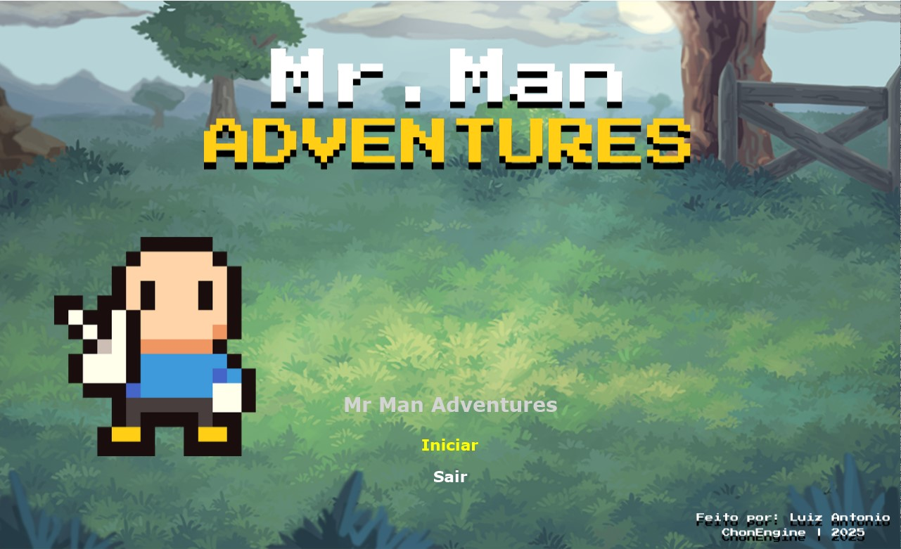

# Mr. Man Adventures 🎮  

**Um jogo de RPG/Ação top-down desenvolvido em Java usando a ChonEngine**  

  

---

## 📖 Sobre o Jogo  
Mr. Man Adventures é um jogo inspirado nos clássicos do gênero como *The Legend of Zelda: A Link to the Past* e *Secret of Mana*, com elementos de *beat 'em ups* como *Teenage Mutant Ninja Turtles: Turtles in Time*.  

**Características principais:**  
- 4 fases com desafios únicos  
- Chefes diferentes em cada fase  
- Combate dinâmico e sistema de itens  
- Trilha sonora retrô e arte pixel art  

---

## ⚙️ Requisitos e Instalação  

## 📋 Pré-requisitos  
- Java JDK 8 ou superior  
- IDE (IntelliJ, Eclipse) ou VS Code com extensões Java  

---

## 🚀 Como Executar  
1. Clone o repositório:  
   ```bash
   git clone https://github.com/seu-usuario/repositorio.git
   cd repositorio
   git checkout game-mrmanadventures
   ```
2. Importe e execute o projeto 
  ## IntelliJ / Eclipse
  1. Vá em `File > Open Project`
  2. Selecione a pasta do projeto

  ## VS Code
  1. Abra a pasta do projeto
  2. Instale as extensões Java recomendadas
  
  ## Execução
  - Localize a classe `Engine.java`
  - Rode o projeto:
    - **IntelliJ**: `Shift + F10`
    - **VS Code**: `Ctrl + F5`
   
---

## 🛠️ Tecnologias Utilizadas

- Java 8+ (Programação Orientada a Objetos)
- **ChonEngine** (Motor gráfico)
- Assets do [OpenGameArt](https://opengameart.org/)

---

## 📜 Créditos

## Sprites:
- **Personagem**: [Mr.Man](https://opengameart.org/content/classic-hero)
- **Inimigos**: [Mago](https://opengameart.org/content/mr-necromancer-man-animated), [Goblins](https://opengameart.org/content/lpc-goblin), [Golem](https://opengameart.org/content/lpc-golem)
- **Fundos de Jogo**: [Backgrounds](https://opengameart.org/content/backgrounds-3)
- **Outros**: [Bolo](https://opengameart.org/content/cake-32x32), [Slash](https://opengameart.org/content/weapon-slash-effect), [Poções](https://opengameart.org/content/shiny-rpg-potions-16x16)

## Músicas:
- Kevin MacLeod: [Pixelland](https://www.youtube.com/watch?v=HUCjaaQR6cs), [Cruising for Goblins](https://www.youtube.com/watch?v=HruhkxJHz2U&list=PLbb_NncyMIqtFkRVdRZDpsFFWusa5cCw6&index=17), [Video Dungeon Boss](https://www.youtube.com/watch?v=geT22uolrcY&list=PLbb_NncyMIqtFkRVdRZDpsFFWusa5cCw6&index=7)
- Jeremy Blake: [Powerup!](https://www.youtube.com/watch?v=l7SwiFWOQqM)
- Adventure Chiptunes: [START](https://www.youtube.com/watch?v=7NBFP0od1ws&list=RD7NBFP0od1ws&start_radio=1)
- Creator Assets: [8-Bit Coin Sound Effect](https://www.youtube.com/watch?v=5v20ztxGvQ0)

## Agradecimentos Especiais:
- Professor Carlos Pantoja

---

## Espero que gostem :)
